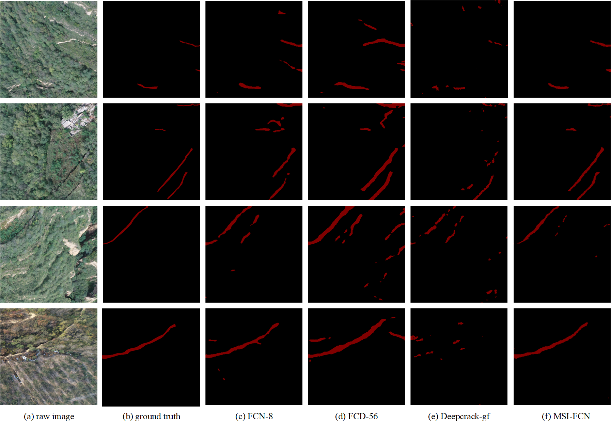

# MSI_FCN
A Tensorflow 2.0 implementation of MSI_FCN.
### 1. Datasets
Dataset:[Aerial Goaf](https://drive.google.com/file/d/1vkI7ojrtDiA_O-Sf7N4EWecyPDGlHbL1/view?usp=sharing)

Checkpoint:[Checkpoint](https://drive.google.com/file/d/1PhCcRWw6jUzO1e3-hMem36MutOH9Iwet/view?usp=sharing)
### 2. Installation
Requirement:

tensorflow 2.0

numpy 

pillow 

matplotlib

### 3.Training
Before the training, please download the dataset. the name rule of dataset should as follow:

-- dataset

---- train

---- trainannot

---- val

---- valannot

---- test

---- testannot

All you need is type following command in the directory of project.
```
python train.py --root the dataset path
```

### 4. Test
All you need is type following command in the directory of project.
```
python test.py --root the dataset path
```

### 5. Evaluation

 Metrics (appeared in our papers):

 |Metric|Description|Usage|
 |:----:|:-----|:----:|
 |P|Precision, `TP/(TP+FP)`|segmentation|
 |R|Recall, `TP/(TP+FN)`|segmentation|
 |TNR|False Positive Rate, `TN/(FP+TN)`|segmentation|
 |F|F-score, `2PR/(P+R)`|segmentation|
 |G|Gmean, `\sqrt(Recall*TNR)`|segmentation|
 |Balanced acc|Balanced accuracy, measures the percentage of the pixels correctly predicted|segmentation|
 |I/U|Mean intersection over union|segmentation|
 


### Notes
When running code in test.py, a lot of warning messages will show on the screen. This is caused by tensorflow 2.0 instead of error.

### References
If you take use of our datasets or code, please cite our papers:
```
@ARTICLE{9039630,  
author={J. {Cheng} and L. {Ye} and Y. {Guo} and J. {Zhang} and H. {An}},  
journal={IEEE Access},  
title={Ground Crack Recognition Based on Fully Convolutional Network With Multi-Scale Input},   
year={2020},  
volume={8},  
number={},  
pages={53034-53048}
}
```
If you have questions, please leave a message in issue block.
